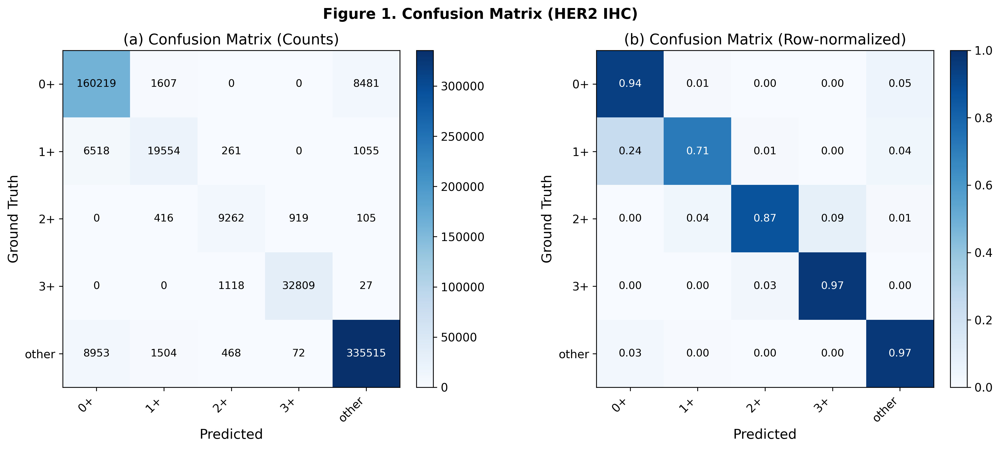
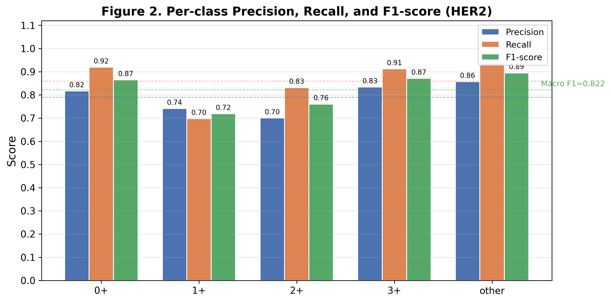
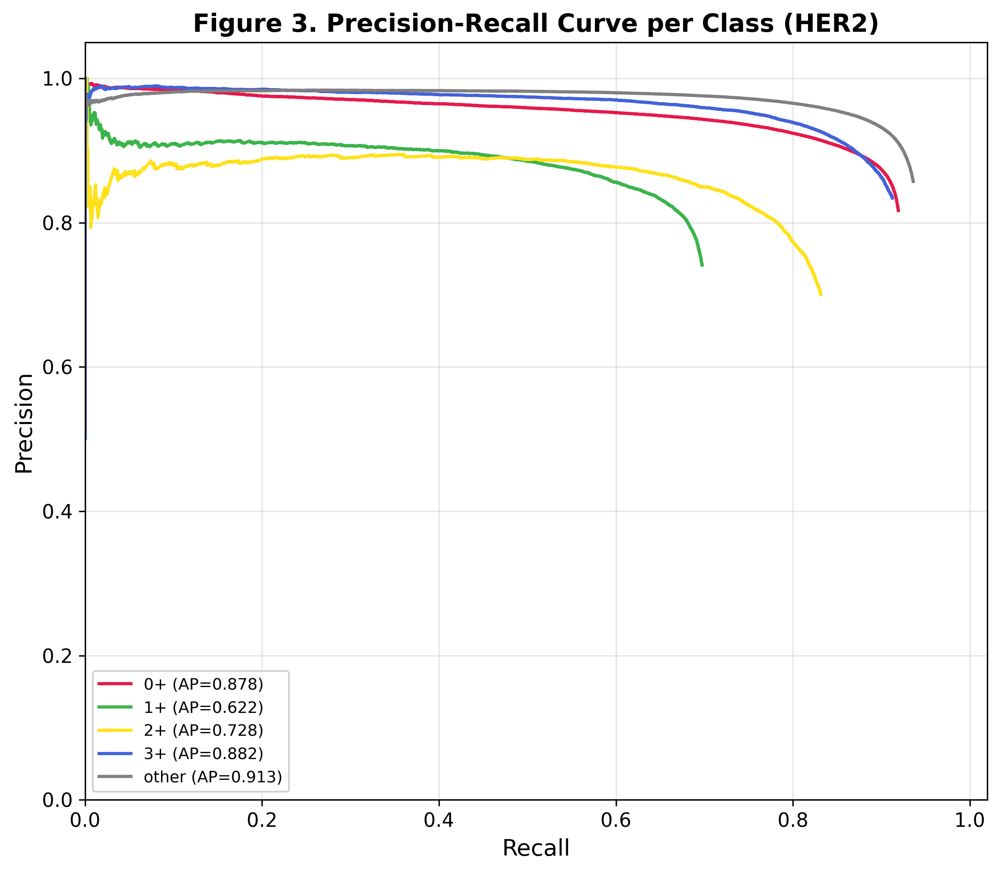
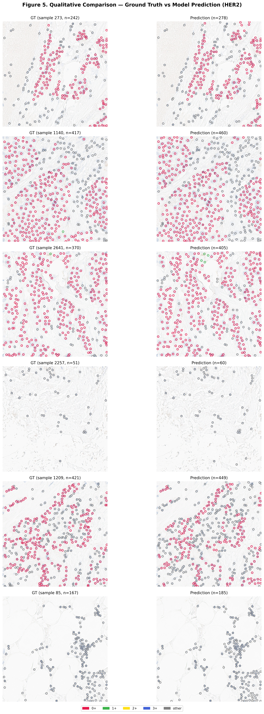
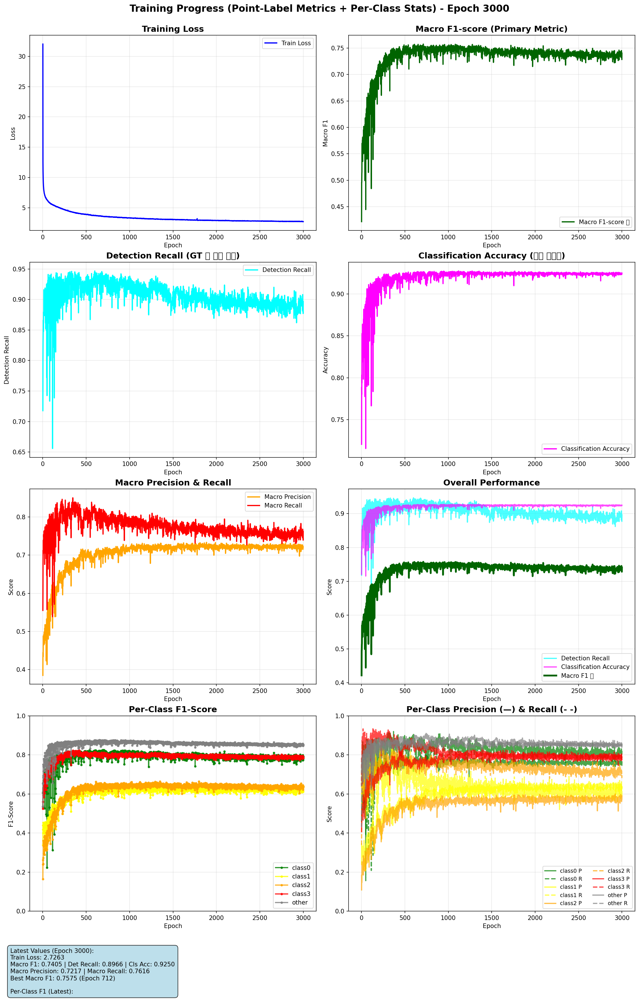
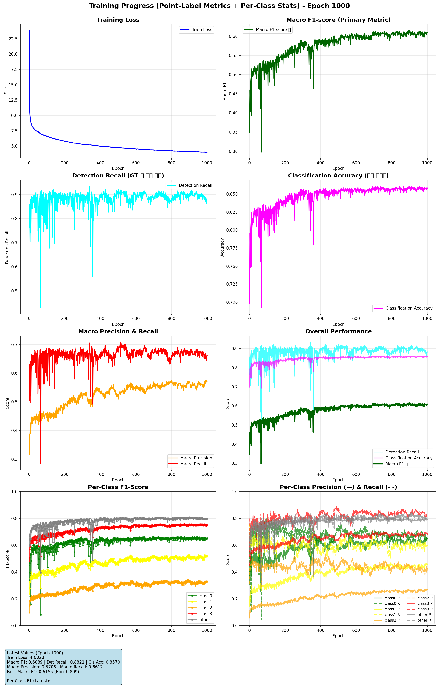

# Precise_BC_cell_scoring

Breast cancer IHC pathology image patches에서 세포/염색 강도 클래스를 검출하고 스코어링하기 위한 실험 코드입니다.  
YOLOv11 PyTorch 구현을 기반으로 HER2, ER/PR IHC patch 데이터를 학습, 검증, 시각화하는 노트북과 유틸리티를 포함합니다.

## 주요 기능

- Leica/AIVIS annotation JSON에서 IHC patch image와 label 생성
- HER2, ER/PR IHC 세포 클래스 검출 학습
- point-label 기반 detection/classification metric 계산
- class imbalance 대응을 위한 `WeightedRandomSampler`와 class-weighted loss
- 학습 curve, confusion matrix, PR/FROC curve, qualitative prediction figure 생성
- COCO/YOLO txt label 형식 학습을 위한 독립 YOLOv11 training script 제공

## 프로젝트 구조

```text
.
├── Data_processing.ipynb              # 원본 slide/annotation에서 patch image, json label 생성
├── data_review.ipynb                  # 생성된 patch/label 검수 및 일부 relabel/delete 작업
├── txt2json.ipynb                     # YOLO txt label을 json label로 변환
├── Precise_IHC_HER2_train.ipynb       # HER2 IHC YOLOv11 학습
├── Precise_IHC_ER_PR_train.ipynb      # ER/PR IHC YOLOv11 학습
├── Precise_IHC_HER2_test.ipynb        # HER2 모델 평가 및 figure/table 생성
├── nets/
│   └── nn.py                          # YOLOv11 backbone, FPN, detection head
├── utils/
│   ├── args.yaml                      # COCO/YOLO 학습 기본 hyperparameter
│   ├── detail_args.yaml               # IHC detail class 학습 hyperparameter
│   ├── dataset.py                     # YOLO txt label용 Dataset, augmentation
│   ├── util.py                        # loss, NMS, mAP, scheduler, ONNX export 등
│   ├── valid.py                       # point-label metric과 시각화 함수
│   └── stain_augmentation.py          # H&E stain augmentation helper
└── YOLOv11-pt-master/
    ├── main.py                        # COCO-style YOLOv11 train/test entrypoint
    ├── main.sh                        # multi-GPU distributed launch wrapper
    └── README.md                      # upstream YOLOv11 사용법
```

## 환경 설정

Python 3.10과 CUDA GPU 환경을 권장합니다.

```bash
conda create -n precise-bc python=3.10
conda activate precise-bc

conda install pytorch torchvision torchaudio pytorch-cuda=12.1 -c pytorch -c nvidia
pip install opencv-python PyYAML tqdm pandas matplotlib scikit-learn scipy pillow jupyter
```

원본 slide를 직접 처리하려면 추가로 OpenSlide가 필요합니다.

```bash
pip install openslide-python
```

시스템에 OpenSlide shared library가 없으면 OS 패키지도 설치해야 합니다.

## 데이터 구조

현재 노트북은 레포 기준 상대 경로로 데이터를 읽습니다.

```text
../../data/
├── Leica/Leica_aivis/
│   ├── results/*.json                 # AIVIS/annotation JSON
│   └── ...                            # 원본 slide/image 파일
└── precise_BC_cell_scoring/
    ├── her2/
    │   ├── patch_images/*.png
    │   └── labels/*.json
    ├── er_pr/
    │   ├── patch_images/*.png
    │   └── labels/*.json
    └── ki67/
        ├── patch_images/*.png
        └── labels/*.json
```

학습 노트북의 JSON label은 다음 형태를 기대합니다.

```json
[
  {
    "class_id": 0,
    "cx": 120.5,
    "cy": 210.0,
    "w": 16.0,
    "h": 16.0,
    "was_nonT": false
  }
]
```

HER2와 ER/PR 학습은 기본적으로 5개 클래스를 사용합니다.

| ID | Class | 의미 |
|---:|---|---|
| 0 | `class0` | 0+ |
| 1 | `class1` | 1+ |
| 2 | `class2` | 2+ |
| 3 | `class3` | 3+ |
| 4 | `other` | 기타/비대상 |

## 실행 순서

### 1. 데이터 전처리

`Data_processing.ipynb`를 실행해 원본 annotation에서 patch image와 label JSON을 생성합니다.

- 입력 annotation: `../../data/Leica/Leica_aivis/results/*.json`
- 출력 root: `../../data/precise_BC_cell_scoring/`
- 생성 대상: `her2`, `er_pr`, `ki67`

생성 후 `data_review.ipynb`에서 patch overlay를 확인하고, 의심 label 재지정 또는 image/label pair 삭제를 수행할 수 있습니다.

### 2. HER2 학습

`Precise_IHC_HER2_train.ipynb`를 위에서부터 실행합니다.

- 입력 image: `../../data/precise_BC_cell_scoring/her2/patch_images/`
- 입력 label: `../../data/precise_BC_cell_scoring/her2/labels/`
- 저장 경로: `../../model/precise_BC_cell_scoring/her2_yolov11/`
- 주요 산출물: `best_model.pt`, `last_model.pt`, `training_progress_epoch_*.png`, validation comparison image

기본 학습 설정은 노트북 내부에서 `batch_size = 16`, `epochs = 1000`으로 지정되어 있습니다. GPU memory에 맞춰 batch size를 먼저 조정하세요.

### 3. ER/PR 학습

`Precise_IHC_ER_PR_train.ipynb`를 실행합니다.

- 입력 image: `../../data/precise_BC_cell_scoring/er_pr/patch_images/`
- 입력 label: `../../data/precise_BC_cell_scoring/er_pr/labels/`
- 저장 경로: `../../model/precise_BC_cell_scoring/ER_PR_yolov11/`
- 주요 산출물: `best_model.pt`, `last_model.pt`, 학습 curve 및 validation visualization

### 4. HER2 평가

`Precise_IHC_HER2_test.ipynb`를 실행합니다.

- 입력 checkpoint: `../../model/precise_BC_cell_scoring/her2_yolov11/best_model.pt`
- 입력 validation data: `../../data/precise_BC_cell_scoring/her2/`
- 출력: confusion matrix, per-class metric table, PR curve, FROC/confidence sweep, qualitative comparison, IoU sensitivity, count correlation

평가 결과 figure와 CSV는 HER2 모델 저장 폴더에 저장됩니다.

## HER2 결과 예시

`../../model/precise_BC_cell_scoring/her2_yolov11/`에 생성된 대표 figure와 table을 `docs/results/`로 복사해 두었습니다.

### Point-detection summary

| Category | Metric | Value |
|---|---|---:|
| Detection | Total GT boxes | 607,829 |
| Detection | Total Predictions | 666,478 |
| Detection | Matched detections | 588,863 |
| Detection | Precision | 0.8835 |
| Detection | Recall | 0.9688 |
| Detection | F1 / DQ | 0.9242 |
| Localization | Mean IoU | 0.8315 |
| Localization | Mean Center Error | 0.95 +/- 0.72 px |
| Classification | Accuracy / CQ | 0.9465 |
| Classification | Macro F1 | 0.8221 |
| Classification | Micro F1 | 0.8748 |
| Panoptic Quality | PQ = DQ x CQ | 0.8748 |
| FROC | Avg FP / image | 26.94 |

### Per-class metric

| Class | GT | TP | FP | FN | Precision | Recall | F1-score |
|---|---:|---:|---:|---:|---:|---:|---:|
| class0 | 174,290 | 160,219 | 35,935 | 14,071 | 0.817 | 0.919 | 0.865 |
| class1 | 28,036 | 19,554 | 6,825 | 8,482 | 0.741 | 0.697 | 0.719 |
| class2 | 11,138 | 9,262 | 3,960 | 1,876 | 0.700 | 0.832 | 0.760 |
| class3 | 35,955 | 32,809 | 6,523 | 3,146 | 0.834 | 0.913 | 0.872 |
| other | 358,410 | 335,515 | 55,876 | 22,895 | 0.857 | 0.936 | 0.895 |
| Macro Avg | 607,829 | 557,359 | 109,119 | 50,470 | 0.790 | 0.859 | 0.822 |

원본 CSV:

- `docs/results/her2_table1_per_class_metrics.csv`
- `docs/results/her2_table2_point_detection_summary.csv`

### Figures

HER2 confusion matrix:



HER2 per-class precision/recall/F1:



HER2 precision-recall curve:



HER2 qualitative prediction:



학습 진행 예시:

| HER2 | ER/PR |
|---|---|
|  |  |

### Tumor / non-tumor region proof-of-concept

HER2 모델 prediction point를 class0-3과 `other`로 나눈 뒤, density map을 만들어 patch 단위 tumor/non-tumor 후보 영역을 그린 예시입니다. 이 결과는 hard segmentation label이 아니라 cell-class density 기반 pseudo-region입니다.

- 예시 모음: `docs/results/tumor_region_examples/README.md`
- 생성 스크립트: `scripts/make_tumor_region_examples.py`

```bash
MPLCONFIGDIR=/tmp/matplotlib /home/user/anaconda3/envs/urban/bin/python scripts/make_tumor_region_examples.py --source model --num-images 5
```

## COCO/YOLO 형식 학습 스크립트

노트북 외에 `YOLOv11-pt-master/main.py`는 COCO-style directory를 직접 학습할 수 있습니다. 기본 데이터 위치는 코드 안의 `data_dir = '../Dataset/COCO'`입니다.

기대 구조:

```text
../Dataset/COCO/
├── train2017.txt
├── val2017.txt
├── images/
│   ├── train2017/*.jpg
│   └── val2017/*.jpg
└── labels/
    ├── train2017/*.txt
    └── val2017/*.txt
```

YOLO label txt는 한 줄에 `class cx cy w h` 형식이며, 좌표는 0-1 정규화 값입니다.

학습:

```bash
cd YOLOv11-pt-master
python main.py --train --input-size 640 --batch-size 32 --epochs 600
```

멀티 GPU:

```bash
cd YOLOv11-pt-master
bash main.sh 4 --train --input-size 640 --batch-size 32 --epochs 600
```

평가:

```bash
cd YOLOv11-pt-master
python main.py --test --input-size 640
```

가중치와 metric plot은 `YOLOv11-pt-master/weights/`에 저장됩니다.

## 설정 파일

- `utils/args.yaml`: COCO/YOLO script에서 사용하는 기본 class name과 augmentation/loss hyperparameter
- `utils/detail_args.yaml`: IHC detail class 실험에 사용하는 hyperparameter. 기본 class name은 `Neutrophil`, `Epithelial`, `Lymphocyte`, `Plasma`, `Eosinophil`, `Connective tissue`로 되어 있으나 HER2/ER_PR 노트북에서는 내부에서 `class0`-`other`로 덮어씁니다.

## Metric 기준

일반 mAP 외에 IHC 노트북은 `utils.valid.compute_point_label_metrics_single`을 사용합니다.

- `detection_recall`: GT point 중 distance threshold 안에서 매칭된 비율
- `classification_accuracy`: 매칭된 객체의 class 일치율
- `macro_precision`, `macro_recall`, `macro_f1`: 클래스별 precision/recall/F1의 macro average
- `class_stats`: 클래스별 TP/FP/FN, precision, recall, F1

기본 point matching distance threshold는 `16` pixel입니다.

## 참고 사항

- 데이터와 모델 산출물은 레포 내부가 아니라 `../../data`, `../../model`에 저장되도록 작성되어 있습니다.
- 노트북에는 실험별 경로와 hyperparameter가 하드코딩된 부분이 있으므로, 다른 서버/폴더에서 실행할 때 첫 번째 경로 설정 셀을 먼저 수정하세요.
- `txt2json.ipynb`는 txt 변환 후 원본 txt 파일을 삭제하는 코드가 포함되어 있으니 실행 전에 백업 여부를 확인하세요.
- `Data_processing.ipynb`와 `data_review.ipynb`에도 파일 삭제/덮어쓰기 셀이 있으므로 셀 단위로 확인하며 실행하는 것을 권장합니다.
