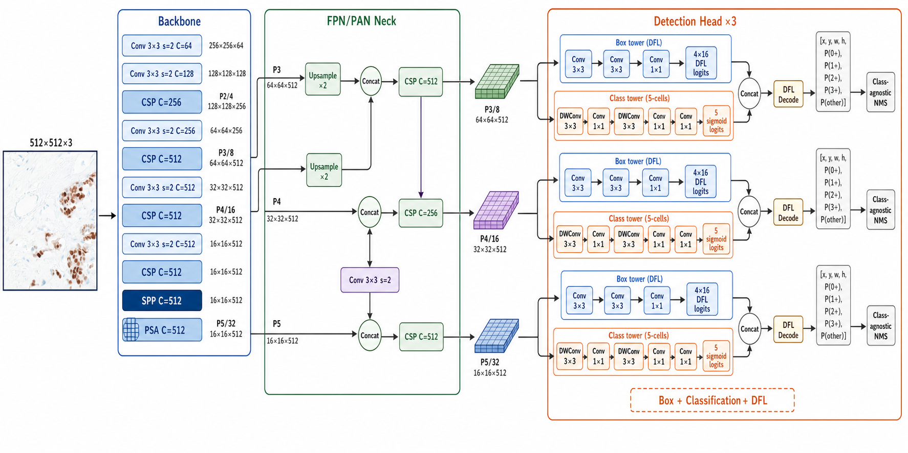
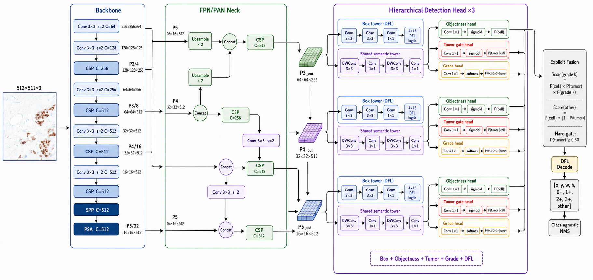
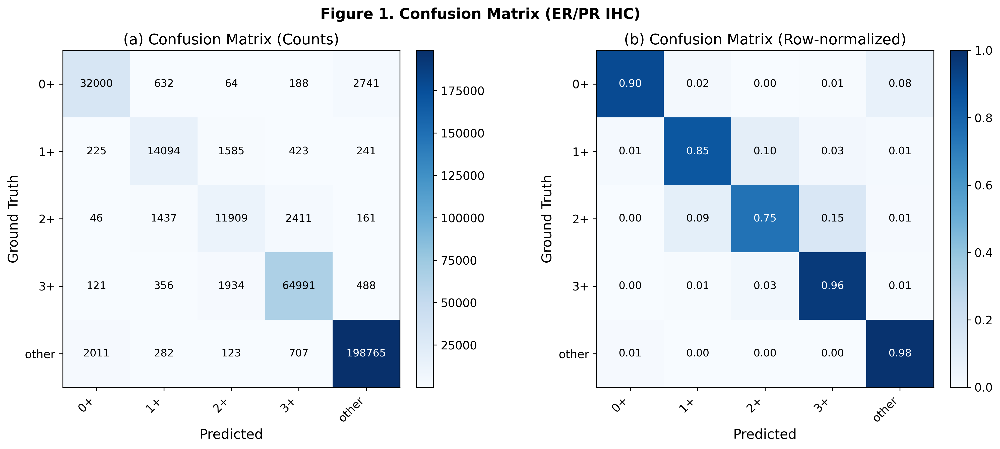
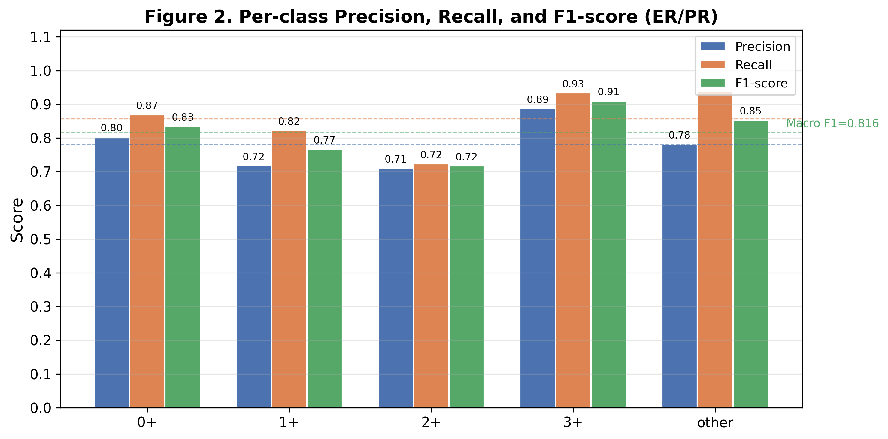
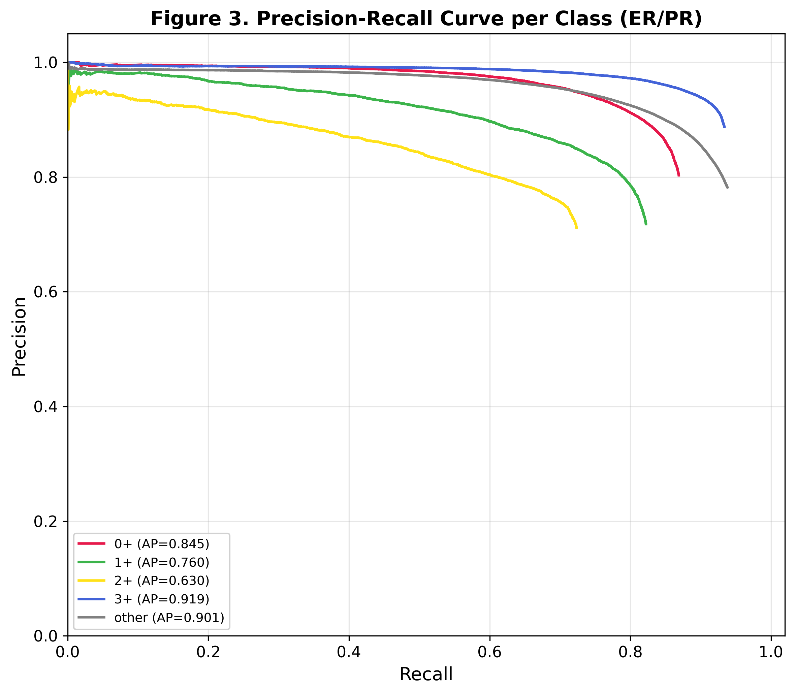
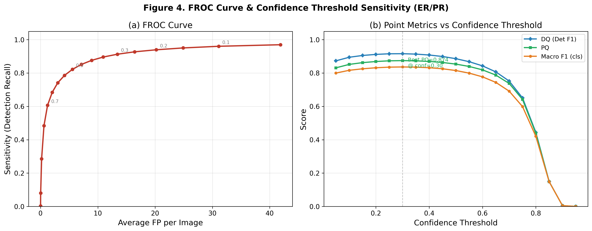
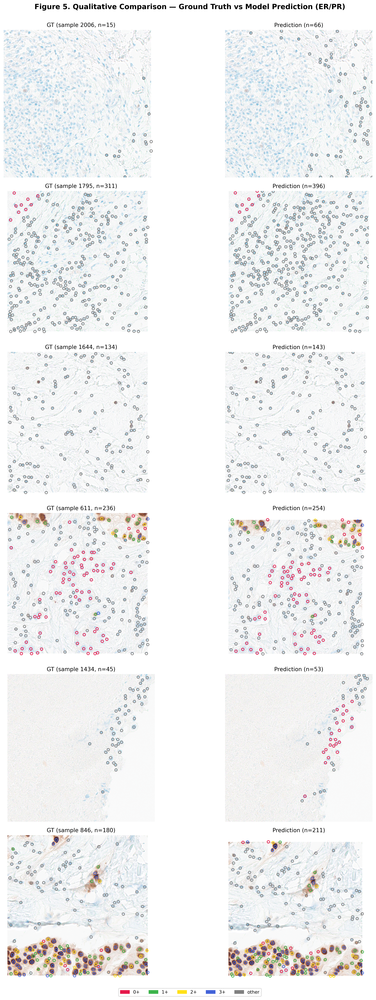
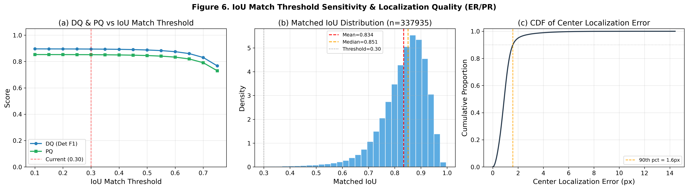
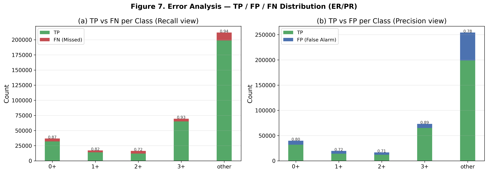
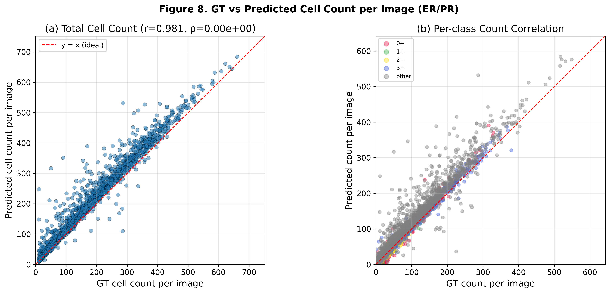

# Precise IHC ER/PR — Hierarchical Point-Detection Evaluation (YOLOv11)

## Key Metrics

- **DQ (Detection Quality)**: class-agnostic detection F1
- **CQ (Classification Quality)**: matched cell classification accuracy
- **PQ (Panoptic Quality)** = DQ × CQ
- **Tumor gate recall**: 실제 Tumor 중 Tumor branch로 보낸 비율
- **Other gate recall**: 실제 Other 중 Other branch로 보낸 비율
- **Gate balanced score**: Tumor/Other gate recall의 조화평균
- **MLE (Mean Localization Error)**: matched pair의 평균 중심점 거리(px)
- **FROC**: Detection recall vs Avg FP/image

## 📌 Experiment Setup

| Item | Value |
| --- | --- |
| Task | ER/PR IHC hierarchical cell detection and intensity scoring |
| Architecture | Cell objectness → Tumor/Other gate → Tumor grade(0+/1+/2+/3+) |
| Validation set | 2,113 patches / 351,889 GT cells / 2 slides |
| Val split | Slide-level split (`val_fraction=0.1`, `seed=242`) |
| Input size | 512×512 |
| Checkpoint | `best_model.pt` (epoch 64) |
| Training stop | Epoch 84에서 early stopping (patience 20) |
| Confidence threshold | 0.10 |
| Tumor gate threshold | 0.50 |
| NMS | **Class-agnostic**, IoU = 0.30 |
| Matching | **IoU-based Hungarian**, IoU ≥ 0.30 |
| Model selection score | 0.5 × Gate score + 0.3 × Macro F1 + 0.2 × Detection recall |

---

## 🧠 Model Architecture — Flat vs Hierarchical

**기존 Flat 5-class 모델**

**Hierarchical 모델**

- 두 모델은 동일한 YOLOv11-m DarkNet backbone과 DarkFPN을 사용함.
- 기존 모델은 5개 class sigmoid score를 하나의 flat classification head에서 직접 예측함.
- Hierarchical 모델은 `Objectness → Tumor/Other gate → Tumor grade`를 분리하고, 최종적으로 기존 평가 코드와 호환되는 `[box + 5 scores]` tensor로 결합함.
- 그림의 입력은 실제 ER/PR 데이터셋 원본 512×512 patch를 수정 없이 사용함.

통합 비교도, 간단 비교도와 편집 가능한 SVG는 `model_architecture/` 폴더에 함께 저장되어 있음.

---

## 🏆 Overall Performance (TL;DR)

| Metric | Value |
| --- | ---: |
| **DQ** (Detection F1) | **0.8945** |
| **CQ** (Classification Accuracy) | **0.9521** |
| **PQ** (= DQ × CQ) | **0.8517** |
| Macro F1 | 0.8163 |
| Micro F1 | 0.8517 |
| Weighted F1 | 0.8518 |
| Tumor gate recall | **0.9733** |
| Other gate recall | **0.9845** |
| Gate balanced score | **0.9789** |
| Other → Tumor error | **1.55%** |
| Tumor → Other error | **2.67%** |
| Mean IoU (matched) | 0.8344 |
| Mean Center Error | 1.01 ± 0.72 px (median 0.90 px) |

- Detection recall은 **96.0%**, precision은 **83.7%**로 높은 recall을 유지하면서 기존 flat 모델보다 false positive가 감소함.
- Matched cell의 classification accuracy는 **95.2%**이며, 명시적 Tumor/Other gate의 양방향 recall이 모두 97% 이상임.
- 목표 오류였던 **Other → Tumor는 1.55%**까지 감소함. 반대 방향인 Tumor → Other도 2.67%로 제한되어 gate가 한쪽으로 크게 치우치지 않음.
- 2+는 여전히 가장 어려운 intensity class지만 F1이 **0.7172**까지 개선됨.

---

## 📊 Table 1 — Per-class Detection + Classification

| Class | GT | TP | FP | FN | Precision | Recall | F1 |
| --- | ---: | ---: | ---: | ---: | ---: | ---: | ---: |
| **0+** (class0) | 36,821 | 32,000 | 7,849 | 4,821 | 0.8030 | 0.8691 | **0.8347** |
| **1+** (class1) | 17,140 | 14,094 | 5,536 | 3,046 | 0.7180 | 0.8223 | **0.7666** |
| **2+** (class2) | 16,460 | 11,909 | 4,839 | 4,551 | 0.7111 | 0.7235 | **0.7172** |
| **3+** (class3) | 69,595 | 64,991 | 8,250 | 4,604 | 0.8874 | 0.9338 | **0.9100** |
| **other** | 211,873 | 198,765 | 55,431 | 13,108 | 0.7819 | 0.9381 | **0.8529** |
| **Macro Avg** | 351,889 | 321,759 | 81,905 | 30,130 | **0.7803** | **0.8574** | **0.8163** |
| **Micro Avg** | — | — | — | — | 0.7971 | 0.9144 | **0.8517** |
| **Weighted Avg** | — | — | — | — | — | — | **0.8518** |

**관찰 포인트**

- **3+가 가장 안정적**: F1 0.9100, recall 93.4%.
- **2+가 현재 bottleneck**: F1 0.7172이며 matched 2+ 중 15.1%가 3+, 9.0%가 1+로 분류됨.
- **1+도 인접 intensity 혼동이 남음**: matched 1+ 중 9.6%가 2+로 이동함.
- Other는 recall 93.8%지만 precision 78.2%이므로 unmatched detection과 Tumor → Other 오류를 함께 관리해야 함.

---

## 📋 Table 2 — Point Detection Summary

| Category | Metric | Value |
| --- | --- | ---: |
| **Detection (class-agnostic)** | Total GT boxes | 351,889 |
|  | Total Predictions | 403,664 |
|  | Matched (TP_det) | 337,935 |
|  | Detection Precision | **0.8372** |
|  | Detection Recall | **0.9603** |
|  | Detection F1 (= DQ) | **0.8945** |
| **Localization** | Mean IoU (matched) | 0.8344 |
|  | Mean Center Error | 1.01 ± 0.72 px |
|  | Median Center Error | 0.90 px |
| **Classification (matched)** | Accuracy (= CQ) | **0.9521** |
|  | Macro F1 | 0.8163 |
|  | Micro F1 | 0.8517 |
|  | Weighted F1 | 0.8518 |
| **Panoptic Quality** | DQ | 0.8945 |
|  | CQ | 0.9521 |
|  | **PQ = DQ × CQ** | **0.8517** |
| **FROC** | Avg FP / image | 31.11 |

---

## 🔁 Same-split Comparison — Flat vs Hierarchical

기존 flat checkpoint를 hierarchical 모델과 동일한 slide-level validation set 및 평가 조건으로 다시 평가한 결과임. 기존 `er_pr_notion.md`의 random patch split 결과와 직접 혼합하지 않음.

| Metric | Flat model | Hierarchical | Change |
| --- | ---: | ---: | ---: |
| DQ | 0.8697 | **0.8945** | **+0.0248** |
| CQ | 0.9404 | **0.9521** | **+0.0117** |
| PQ | 0.8179 | **0.8517** | **+0.0338** |
| Macro F1 | 0.7588 | **0.8163** | **+0.0576** |
| Avg FP/image | 41.50 | **31.11** | **−10.39** |
| Other → Tumor | 2.50% | **1.55%** | **−0.95%p** |
| Tumor → Other | **2.42%** | 2.67% | +0.25%p |

- 계층형 구조는 목표였던 Other → Tumor 오류를 약 **38% 상대 감소**시킴.
- 동시에 PQ와 Macro F1이 개선되고 FP/image가 약 25% 감소해, 단순히 모든 세포를 Other로 보내 얻은 개선이 아님.
- Tumor → Other는 0.25%p 증가했으므로 독립 slide test에서도 양방향 gate error를 계속 보고해야 함.

---

## 🖼️ Figures

### Figure 1 — Confusion Matrix (Count / Row-normalized)

- Matched 기준 diagonal 비율은 0+ 89.8%, 1+ 85.1%, 2+ 74.6%, 3+ 95.7%, other 98.5%.
- Other → Tumor는 총 1.55%로 잘 억제됨.
- 가장 큰 잔여 오류는 2+ → 3+ 15.1%, 2+ → 1+ 9.0%, 0+ → other 7.7%임.

### Figure 2 — Per-class Precision / Recall / F1

- 모든 class의 F1이 0.71 이상이며 3+가 가장 높음.
- Other는 recall에 비해 precision이 낮아 낮은 confidence threshold에서의 추가 검출 영향을 받음.

### Figure 3 — Precision-Recall Curve per Class (AP)

| Class | AP |
| --- | ---: |
| 0+ | 0.845 |
| 1+ | 0.760 |
| 2+ | **0.630** |
| 3+ | **0.919** |
| other | 0.901 |

- 2+가 가장 낮음. 기존 random-patch 보고서의 flat 2+ AP 0.258보다 높지만 validation split이 달라 직접적인 성능 차이로 해석하지 않음.
- 3+와 other는 넓은 recall 범위에서 높은 precision을 유지함.

### Figure 4 — FROC Curve & Confidence Threshold Sweep

- 보고 표의 `conf=0.10`은 detection recall 96.0%, Avg FP/image 31.11의 high-recall 운영점임.
- **Best PQ = 0.8744 @ conf=0.30**으로 재확인됨. 이때 DQ 0.9158, CQ 0.9547, Macro F1 0.8364, Avg FP/image 13.41임.
- 세포 누락 최소화가 목적이면 0.10, 균형 성능과 FP 감소가 목적이면 0.30을 우선 검증할 수 있음.

### Figure 5 — Qualitative Comparison (GT vs Prediction)

- Slide-level validation patch에서 GT와 hierarchical prediction을 intensity class별로 비교함.
- 정성 검수 시 1+/2+/3+ 경계, 0+/other 경계, 고밀도 영역의 중복·추가 검출을 우선 확인해야 함.

### Figure 6 — IoU Match Threshold Sensitivity & Localization Quality

- 현재 IoU match threshold 0.30 부근에서 DQ/PQ가 안정적임.
- Matched IoU는 평균 0.834, median 0.851.
- Center localization error의 90th percentile은 **1.59 px**로 위치 정확도는 양호함.

### Figure 7 — TP / FP / FN Error Analysis

- 2+의 FN 비율이 27.6%로 가장 높고, 1+는 17.8%, 0+는 13.1%임.
- Other의 FP 절대 개수는 55,431개지만 이는 class confusion뿐 아니라 unmatched prediction도 포함함.

### Figure 8 — Per-image GT vs Predicted Count Scatter

- 이미지당 total cell count 상관은 **r=0.981**로 높음.
- 전체 count 상관과 intensity 구성비의 정확성은 별개이므로 ER/PR positive percentage와 H-score를 slide 단위로 추가 평가해야 함.

---

## 🔍 Discussion & Next Steps

1. **Hierarchical gate의 목표는 달성됨**
   - Other → Tumor 1.55%, Tumor → Other 2.67%, gate balanced score 0.9789.
   - 기존 flat 모델 대비 Other → Tumor와 FP/image를 줄이면서 PQ와 Macro F1도 개선됨.

2. **2+ intensity가 다음 우선 bottleneck**
   - F1 0.7172, AP 0.630이며 오류가 1+/3+ 인접 intensity로 집중됨.
   - 1+/2+/3+ 경계 사례의 pathology review, hard-example mining 및 ordinal-aware loss를 검토할 수 있음.

3. **운영 confidence threshold를 목적에 맞게 선택**
   - `conf=0.10`: recall 우선, DQ 0.8945, PQ 0.8517, FP/image 31.11.
   - `conf=0.30`: 균형 성능 우선, DQ 0.9158, PQ 0.8744, FP/image 13.41.
   - 최종 threshold는 독립 holdout에서 고정해야 함.

4. **ER과 PR subgroup를 분리해 평가**
   - 현재 결과는 ER/PR patch를 통합한 수치임.
   - Marker별 stain distribution 차이를 확인하기 위해 ER-only / PR-only gate recall, DQ, CQ, per-class F1을 별도 보고해야 함.

5. **Slide-level clinical metric으로 확장**
   - Positive-cell percentage, H-score MAE, ICC 및 Bland–Altman 분석을 patient/slide 단위로 추가해야 함.

6. **독립 test set 필요**
   - Slide-level split을 사용했지만 validation이 2 slides뿐이고 model selection에도 사용됨.
   - 현재 수치는 최종 독립 test 성능이 아니므로 더 많은 patient/slide holdout에서 재평가해야 함.
