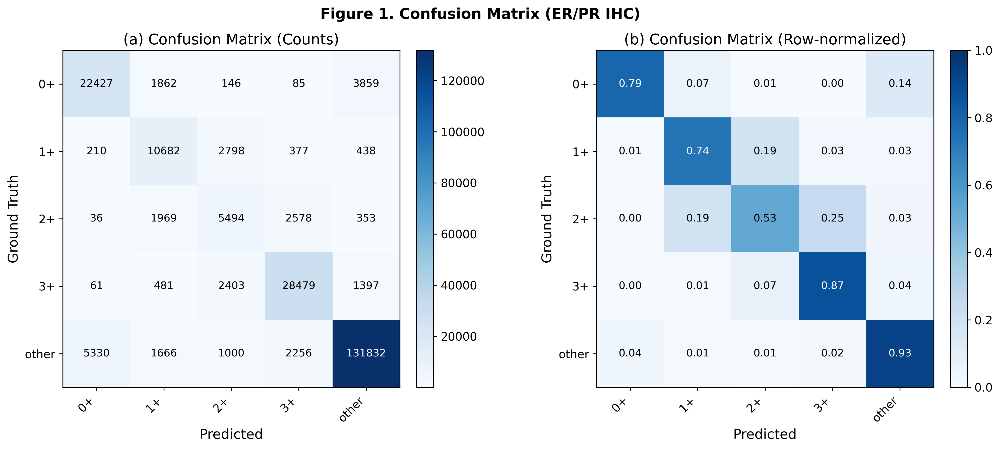
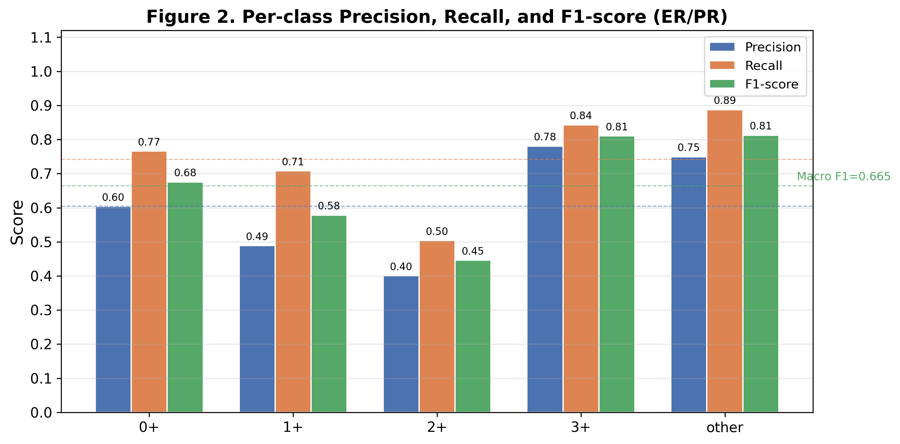
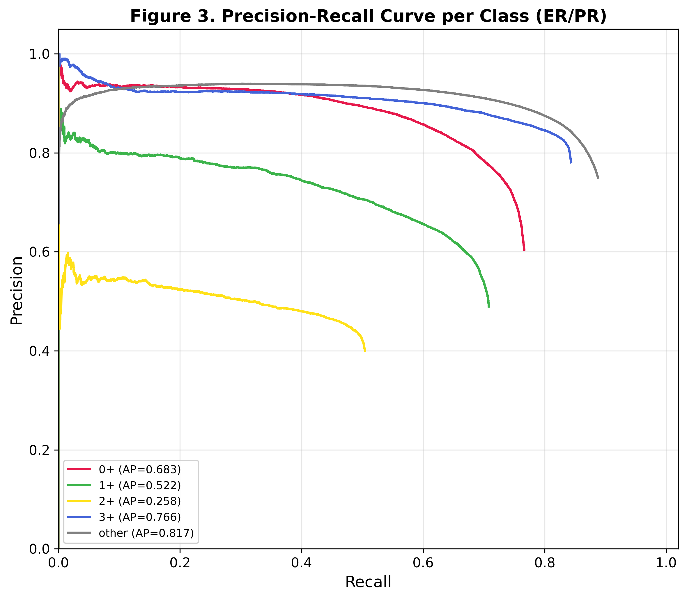
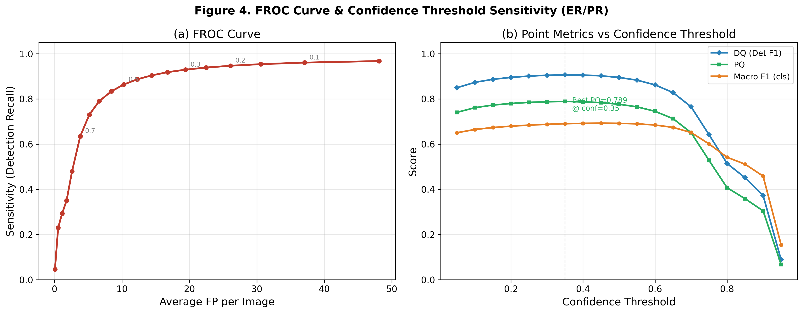
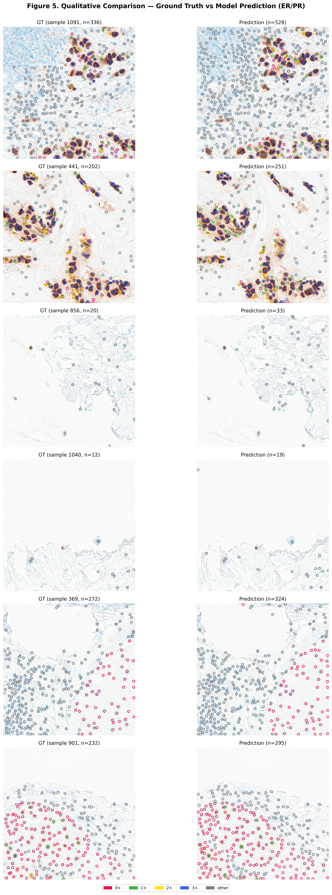
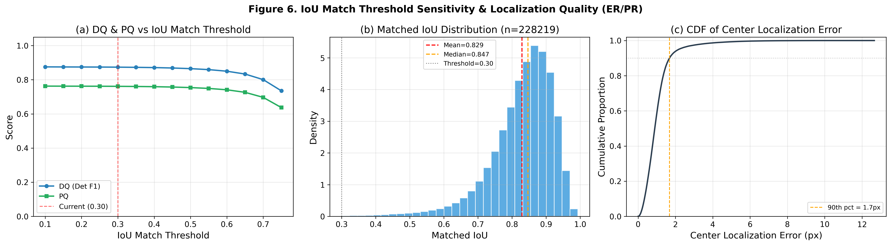
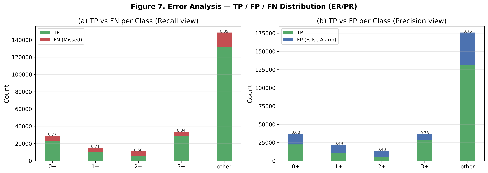
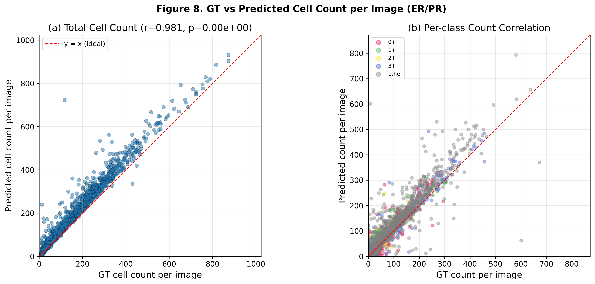

# Precise IHC ER/PR — Point-Detection Evaluation (YOLOv11)

## Key Metrics

- **DQ (Detection Quality)**: class-agnostic 탐지 F1
- **CQ (Classification Quality)**: 매칭된 세포의 분류 정확도
- **PQ (Panoptic Quality)** = DQ × CQ
- **MLE (Mean Localization Error)**: 매칭 쌍의 평균 유클리드 거리 (px)
- **FROC**: Sensitivity vs Avg FP/image

## 📌 Experiment Setup

| Item | Value |
| --- | --- |
| Task | ER/PR IHC cell detection & intensity scoring (0+/1+/2+/3+/other) |
| Validation set | 1,531 patches / 237,519 GT cells |
| Val split | `train_test_split(test_size=0.1, random_state=242)` |
| Input size | 512×512 |
| Checkpoint | `best_model.pt` (epoch 340) |
| Confidence threshold | 0.10 |
| NMS | **Class-agnostic**, IoU = 0.30 |
| Matching | **IoU-based Hungarian**, IoU ≥ 0.30 |

---

## 🏆 Overall Performance (TL;DR)

| Metric | Value |
| --- | --- |
| **DQ** (Detection F1) | **0.8735** |
| **CQ** (Classification Accuracy) | **0.8716** |
| **PQ** (= DQ × CQ) | **0.7614** |
| Macro F1 | 0.6649 |
| Micro F1 | 0.7614 |
| Weighted F1 | 0.7640 |
| Mean IoU (matched) | 0.8293 |
| Mean Center Error | 1.02 ± 0.78 px (median 0.89 px) |

- 탐지 Recall은 **96.1%**로 높지만 Precision은 **80.1%**로, 세포를 놓치기보다 추가로 예측하는 high-recall 경향이 나타남.
- 매칭된 세포의 분류 정확도는 **87.2%**. 3+와 other는 안정적이지만 1+/2+ intensity 경계에서 오류가 집중됨.
- 평균 IoU 0.83, 중심 오차 약 1 px로 localization은 양호하며 주요 병목은 **intensity classification과 false positive 제어**임.

---

## 📊 Table 1 — Per-class Detection + Classification

| Class | GT | TP | FP | FN | Precision | Recall | F1 |
| --- | ---: | ---: | ---: | ---: | ---: | ---: | ---: |
| **0+** (class0) | 29,263 | 22,427 | 14,697 | 6,836 | 0.6041 | 0.7664 | **0.6756** |
| **1+** (class1) | 15,088 | 10,682 | 11,152 | 4,406 | 0.4892 | 0.7080 | **0.5786** |
| **2+** (class2) | 10,894 | 5,494 | 8,226 | 5,400 | 0.4004 | 0.5043 | **0.4464** |
| **3+** (class3) | 33,771 | 28,479 | 7,994 | 5,292 | 0.7808 | 0.8433 | **0.8109** |
| **other** | 148,503 | 131,832 | 44,008 | 16,671 | 0.7497 | 0.8877 | **0.8129** |
| **Macro Avg** | 237,519 | 198,914 | 86,077 | 38,605 | **0.6049** | **0.7419** | **0.6649** |
| **Micro Avg** | — | — | — | — | 0.6980 | 0.8375 | **0.7614** |
| **Weighted Avg** | — | — | — | — | — | — | **0.7640** |

**관찰 포인트**

- **2+가 핵심 bottleneck**: F1 0.4464, Recall 50.4%, Precision 40.0%. GT 2+ 중 matched classification에서 약 25%가 3+, 19%가 1+로 분류됨.
- **1+도 중간 intensity 혼동의 영향**: F1 0.5786이며 matched 1+ 중 약 19%가 2+로 이동함.
- **3+와 other는 상대적으로 안정적**: 각각 F1 0.8109, 0.8129. 다만 other가 GT의 62.5%를 차지해 micro/weighted 지표에 큰 영향을 줌.
- Macro F1 0.6649와 Micro F1 0.7614의 차이는 1+/2+ 열세와 클래스 불균형을 반영함.

---

## 📋 Table 2 — Point Detection Summary

| Category | Metric | Value |
| --- | --- | ---: |
| **Detection (class-agnostic)** | Total GT boxes | 237,519 |
|  | Total Predictions | 284,991 |
|  | Matched (TP_det) | 228,219 |
|  | Detection Precision | **0.8008** |
|  | Detection Recall | **0.9608** |
|  | Detection F1 (= DQ) | **0.8735** |
| **Localization** | Mean IoU (matched) | 0.8293 |
|  | Mean Center Error | 1.02 ± 0.78 px |
|  | Median Center Error | 0.89 px |
| **Classification (matched)** | Accuracy (= CQ) | **0.8716** |
|  | Macro F1 | 0.6649 |
|  | Micro F1 | 0.7614 |
|  | Weighted F1 | 0.7640 |
| **Panoptic Quality** | DQ | 0.8735 |
|  | CQ | 0.8716 |
|  | **PQ = DQ × CQ** | **0.7614** |
| **FROC** | Avg FP / image | 37.08 |

---

## 🖼️ Figures

### Figure 1 — Confusion Matrix (Count / Row-normalized)

- 3+와 other의 대각 비율은 각각 87%, 93%로 안정적.
- 2+는 대각 비율이 53%로 가장 낮고, 1+로 19%, 3+로 25% 혼동되며 intensity 순서상 인접 클래스로 오류가 집중됨.
- 0+는 other로 14% 혼동되어 negative tumor cell과 non-target cell의 경계 검수가 필요함.

### Figure 2 — Per-class Precision / Recall / F1

- 0+/1+/2+에서 모두 Recall이 Precision보다 높아 over-prediction 경향을 보임.
- 특히 2+는 Precision 0.40 / Recall 0.50로 분류 경계와 예측 calibration을 동시에 개선해야 함.

### Figure 3 — Precision-Recall Curve per Class (AP)

| Class | AP |
| --- | ---: |
| 0+ | 0.683 |
| 1+ | 0.522 |
| 2+ | **0.258** |
| 3+ | 0.766 |
| other | **0.817** |

- 2+ PR curve가 전 confidence 구간에서 가장 낮아, 단순 threshold 조정만으로는 2+ 성능을 충분히 회복하기 어려움.

### Figure 4 — FROC Curve & Confidence Threshold Sweep

- 현재 `conf=0.10`은 Detection Recall 96.1%, Avg FP/image 37.08의 high-recall 운영점.
- sweep에서 **best PQ ≈ 0.789 @ conf=0.35**로 나타나, 기본 운영 threshold는 0.30–0.40 구간을 추가 검증할 가치가 있음.
- 다만 threshold 선택은 cell recall을 우선할지, FP와 PQ를 우선할지에 따라 결정해야 함.

### Figure 5 — Qualitative Comparison (GT vs Prediction)

- 대표 validation patch에서 GT(왼쪽)와 prediction(오른쪽)을 intensity class 색상으로 overlay.
- 1+/2+ 경계 오류, other/0+ 구분, 고밀도 영역의 FP를 우선적으로 정성 검수할 필요가 있음.

### Figure 6 — IoU Match Threshold Sensitivity & Localization Quality

- IoU threshold 0.30 근처에서 DQ/PQ가 안정적이며, 0.60 이상에서 점진적으로 감소함.
- Matched IoU는 평균 0.829, median 0.847.
- Center localization error의 90th percentile은 약 **1.7 px**로 localization 품질은 양호함.

### Figure 7 — TP / FP / FN Error Analysis

- 2+의 FN 비율은 49.6%로 가장 높고, 1+도 29.2%로 높음.
- 절대 FP는 other 44,008개가 가장 많으며, 세포 수가 많은 클래스의 규모 효과와 conf=0.10의 high-recall 설정이 함께 반영됨.

### Figure 8 — Per-image GT vs Predicted Count Scatter

- 이미지당 total cell count 상관은 **r=0.981**로 매우 높아 전체 counting은 안정적.
- 다만 전체 count가 맞는 것과 intensity 비율이 맞는 것은 별개이므로, 1+/2+ 구성비와 slide-level H-score 오차를 별도로 평가해야 함.

---

## 🔍 Discussion & Next Steps

1. **2+ intensity가 최우선 bottleneck**
   - F1 0.4464, AP 0.258이며 오류가 1+/3+ 인접 intensity로 집중됨.
   - 1+/2+/3+ 경계 샘플의 pathology review, hard-example mining, 경계 샘플 추가 annotation을 우선 권장.
   - 단순 class weight 증가는 FP를 더 늘릴 수 있으므로 confusion pair 기반 sampling과 calibration이 필요.

2. **Detection은 high-recall이지만 FP 제어가 필요**
   - Recall 0.9608, Mean IoU 0.8293으로 탐지/위치 품질은 양호함.
   - Precision 0.8008, Avg FP/image 37.08이므로 conf 0.30–0.40 구간을 validation/test set에서 재확인할 필요가 있음.

3. **ER과 PR subgroup를 분리해 평가**
   - 현재 결과는 ER/PR 패치를 통합한 성능임.
   - marker별 stain distribution과 intensity 판정 특성이 다를 수 있으므로 ER-only / PR-only DQ, CQ, per-class F1을 별도 보고해야 함.

4. **Cell metric에서 slide-level clinical metric으로 확장**
   - 전체 count 상관은 높지만 ER/PR 실제 활용을 위해서는 positive-cell percentage와 H-score 일치도가 필요.
   - GT vs prediction의 H-score, MAE, ICC, Bland–Altman을 patient/slide 단위로 추가 권장.

5. **최종 성능은 patient/slide-level holdout으로 재평가**
   - 현재 수치는 모델 선택에 사용된 validation split 결과이며 독립 test 성능이 아님.
   - 동일 slide/patient의 patch가 train/validation에 나뉘지 않도록 group split 후 최종 보고가 필요.
