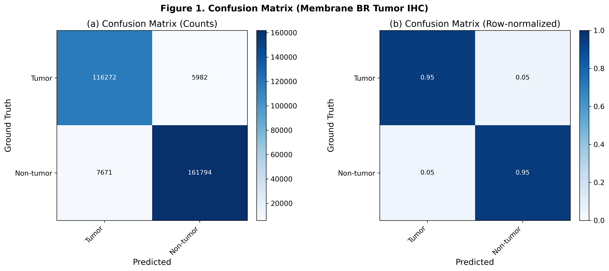
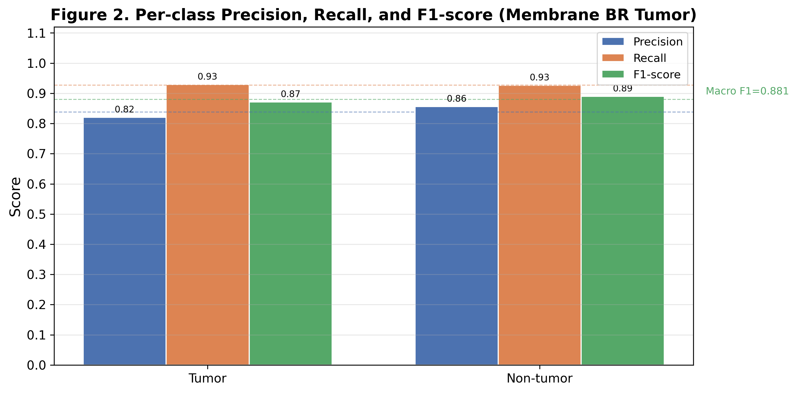
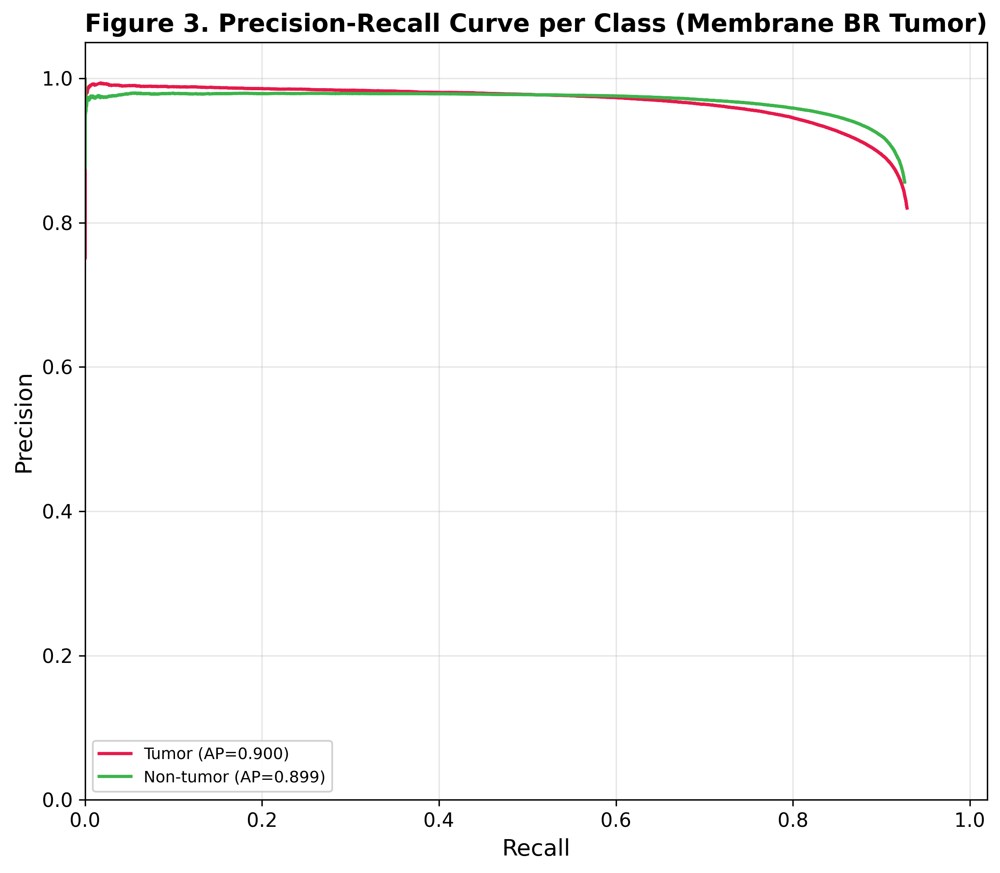
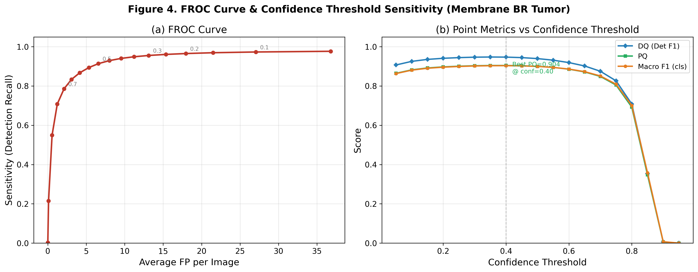
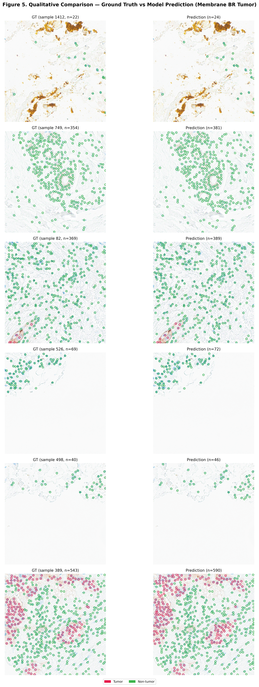
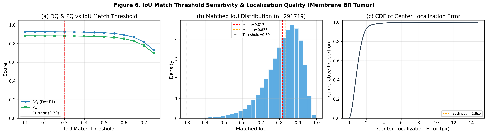
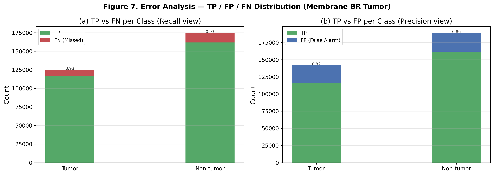
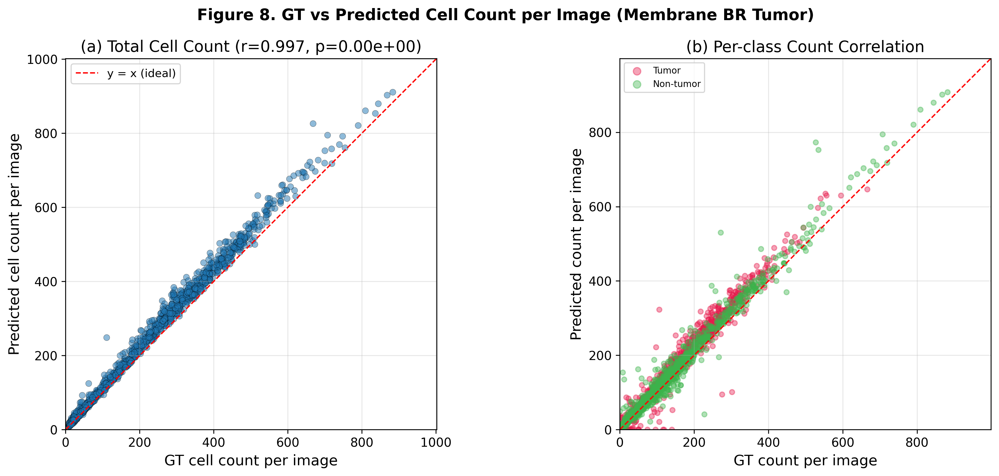

# Precise IHC Membrane BR Tumor — Point-Detection Evaluation (YOLOv11)

## 🤖 AI Assistant Context

| Item | Source of truth |
| --- | --- |
| Model role | HER2 membrane IHC patch에서 세포를 탐지하고 Tumor / Non-tumor로 분류 |
| Data source | `../../data/precise_BC_cell_scoring/her2/` |
| Label field | `was_nonT` (`class_id`가 아님) |
| Class mapping | `0 = Tumor`, `1 = Non_Tumor` |
| Checkpoint | `../../model/precise_BC_cell_scoring/IHC_membrane_BR_tumor/best_model.pt` |
| Train notebook | `Precise_IHC_membrane_BR_tumor_train.ipynb` |
| Evaluation notebook | `Precise_IHC_membrane_BR_tumor_test.ipynb` |

> **Important:** 이 모델은 tissue-level tumor mask segmentation 모델이 아니라 **세포 단위 binary detection/classification 모델**이다. Tumor region mask는 별도 pipeline으로 다룬다.

## Key Metrics

- **DQ (Detection Quality)**: class-agnostic 탐지 F1
- **CQ (Classification Quality)**: 매칭된 세포의 Tumor / Non-tumor 분류 정확도
- **PQ (Panoptic Quality)** = DQ × CQ
- **MLE (Mean Localization Error)**: 매칭 쌍의 평균 중심 거리 (px)
- **FROC**: Sensitivity vs Avg FP/image

## 📌 Experiment Setup

| Item | Value |
| --- | --- |
| Task | HER2 membrane IHC cell detection + Tumor/Non-tumor classification |
| Validation set | 1,441 patches / 299,779 GT cells |
| Val split | `train_test_split(test_size=0.1, random_state=242)` |
| Input size | 512×512 |
| Checkpoint | `best_model.pt` (epoch 247) |
| Confidence threshold | 0.10 |
| NMS | **Class-agnostic**, IoU = 0.30 |
| Matching | **IoU-based Hungarian**, IoU ≥ 0.30 |

---

## 🏆 Overall Performance (TL;DR)

| Metric | Value |
| --- | ---: |
| **DQ** (Detection F1) | **0.9254** |
| **CQ** (Classification Accuracy) | **0.9532** |
| **PQ** (= DQ × CQ) | **0.8821** |
| Macro F1 | 0.8806 |
| Micro F1 | 0.8821 |
| Weighted F1 | 0.8822 |
| Mean IoU (matched) | 0.8170 |
| Mean Center Error | 1.06 ± 0.75 px (median 0.94 px) |

- Detection Recall **97.3%**, Precision **88.2%**로 대부분의 세포를 찾지만 high-recall 설정에 따른 FP가 존재함.
- 매칭된 세포의 Tumor/Non-tumor 분류 정확도는 **95.3%**로 양호하고, 두 클래스의 F1이 0.87–0.89로 비교적 균형적임.
- 전체 counting 상관이 **r=0.997**로 매우 높아 세포 수 추정에 강함.

---

## 📊 Table 1 — Per-class Detection + Classification

| Class | GT | TP | FP | FN | Precision | Recall | F1 |
| --- | ---: | ---: | ---: | ---: | ---: | ---: | ---: |
| **Tumor** | 125,144 | 116,272 | 25,479 | 8,872 | 0.8203 | 0.9291 | **0.8713** |
| **Non-tumor** | 174,635 | 161,794 | 27,157 | 12,841 | 0.8563 | 0.9265 | **0.8900** |
| **Macro Avg** | 299,779 | 278,066 | 52,636 | 21,713 | **0.8383** | **0.9278** | **0.8806** |
| **Micro Avg** | — | — | — | — | 0.8408 | 0.9276 | **0.8821** |
| **Weighted Avg** | — | — | — | — | — | — | **0.8822** |

**관찰 포인트**

- Tumor F1 0.8713, Non-tumor F1 0.8900으로 클래스 간 편차가 작음.
- 두 클래스 모두 Recall이 Precision보다 높아 현재 `conf=0.10`이 민감도 중심 설정임을 보여줌.
- Non-tumor GT가 58.3%로 더 많지만 macro/micro F1이 유사해 클래스 불균형의 성능 영향은 큰 편이 아님.

---

## 📋 Table 2 — Point Detection Summary

| Category | Metric | Value |
| --- | --- | ---: |
| **Detection (class-agnostic)** | Total GT boxes | 299,779 |
|  | Total Predictions | 330,702 |
|  | Matched (TP_det) | 291,719 |
|  | Detection Precision | **0.8821** |
|  | Detection Recall | **0.9731** |
|  | Detection F1 (= DQ) | **0.9254** |
| **Localization** | Mean IoU (matched) | 0.8170 |
|  | Mean Center Error | 1.06 ± 0.75 px |
|  | Median Center Error | 0.94 px |
| **Classification (matched)** | Accuracy (= CQ) | **0.9532** |
|  | Macro F1 | 0.8806 |
|  | Micro F1 | 0.8821 |
|  | Weighted F1 | 0.8822 |
| **Panoptic Quality** | DQ | 0.9254 |
|  | CQ | 0.9532 |
|  | **PQ = DQ × CQ** | **0.8821** |
| **FROC** | Avg FP / image | 27.05 |

---

## 🖼️ Figures

### Figure 1 — Confusion Matrix (Count / Row-normalized)

- Matched Tumor의 약 95%가 Tumor로, matched Non-tumor의 약 95%가 Non-tumor로 분류됨.
- Tumor→Non-tumor 5,982건, Non-tumor→Tumor 7,671건으로 분류 오류가 비교적 대칭적임.

### Figure 2 — Per-class Precision / Recall / F1

- 두 클래스 모두 Recall 약 0.93, F1 0.87–0.89로 균형적.
- Precision이 Recall보다 7–11%p 낮아 threshold 조정으로 FP를 줄일 여지가 있음.

### Figure 3 — Precision-Recall Curve per Class (AP)

| Class | AP |
| --- | ---: |
| Tumor | **0.900** |
| Non-tumor | **0.899** |

- 두 PR curve가 거의 겹치며 confidence 변화에 대해 양호한 균형을 보임.

### Figure 4 — FROC Curve & Confidence Threshold Sweep

- 현재 `conf=0.10`은 Detection Recall 97.3%, Avg FP/image 27.05의 high-recall 운영점.
- sweep에서 **best PQ ≈ 0.904 @ conf=0.40**으로 나타남.
- 실제 운영시 conf 0.35–0.45 구간에서 FP 감소와 recall 유지의 trade-off를 별도 test set에서 확인해야 함.

### Figure 5 — Qualitative Comparison (GT vs Prediction)

- HER2 membrane patch의 GT(왼쪽)와 prediction(오른쪽)을 Tumor/Non-tumor 색상으로 overlay.
- membrane staining이 불완전하거나 고밀도인 경계 영역을 중심으로 FP/FN을 정성 검수할 필요가 있음.

### Figure 6 — IoU Match Threshold Sensitivity & Localization Quality

- Matched IoU: mean 0.817, median 0.835.
- Center localization error 90th percentile: **1.8 px**.
- IoU match threshold 0.30 근처에서 DQ/PQ가 안정적이며 0.60 이상에서 감소가 커짐.

### Figure 7 — TP / FP / FN Error Analysis

- Tumor FN rate 7.1%, Non-tumor FN rate 7.4%로 유사함.
- 절대 FP는 Tumor 25,479, Non-tumor 27,157건으로 유사하며, threshold 조정의 주요 개선 대상임.

### Figure 8 — Per-image GT vs Predicted Count Scatter

- 전체 cell count 상관은 **r=0.997**로 매우 높음.
- Tumor/Non-tumor 별 산포도 대부분 `y=x` 근처에 분포하지만, 세포가 많은 patch에서 일부 over-counting이 보임.

---

## 🔍 Discussion & Next Steps

1. **운영 threshold 재설정**
   - `conf=0.10`은 recall 최우선 설정이며, validation sweep은 `conf=0.40`에서 더 높은 PQ를 보임.
   - 독립 test set에서 conf 0.35–0.45를 재검증한 후 운영점을 고정할 것.

2. **정성 error review**
   - Tumor/Non-tumor 오류가 비교적 대칭적이므로 경계 세포, 불완전 membrane, 염증 세포 등 오류 phenotype를 세분화해 검수.

3. **Tissue segmentation과 역할 분리**
   - 이 모델의 결과를 tumor region mask로 직접 해석하지 말 것.
   - 최종 pipeline에서는 tissue-level tumor mask 내의 세포 예측만 집계하는 단계가 필요.

4. **Nucleus model과 modality fusion 검토**
   - membrane와 nucleus model은 서로 다른 데이터(HER2 vs ER/PR)로 학습되었으므로 수치를 직접 우열 비교하지 말 것.
   - 동일 세포/슬라이드 modality가 정렬된 경우에만 fusion 효과를 검증.

5. **독립 patient/slide-level test**
   - 현재 수치는 model selection에 사용된 patch-level validation 결과임.
   - 최종 보고는 patient/slide group split을 적용한 holdout set에서 재산출해야 함.
