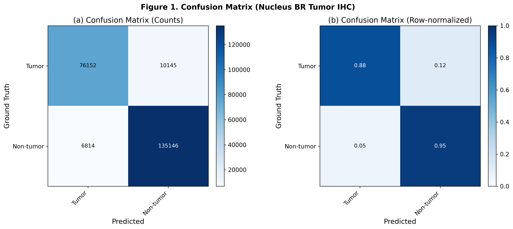
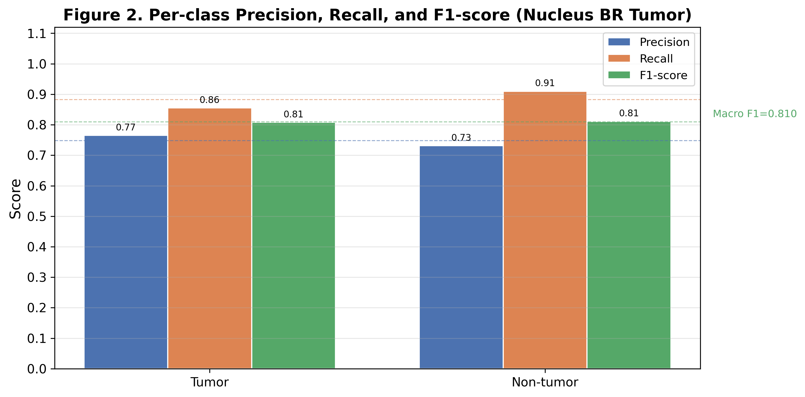
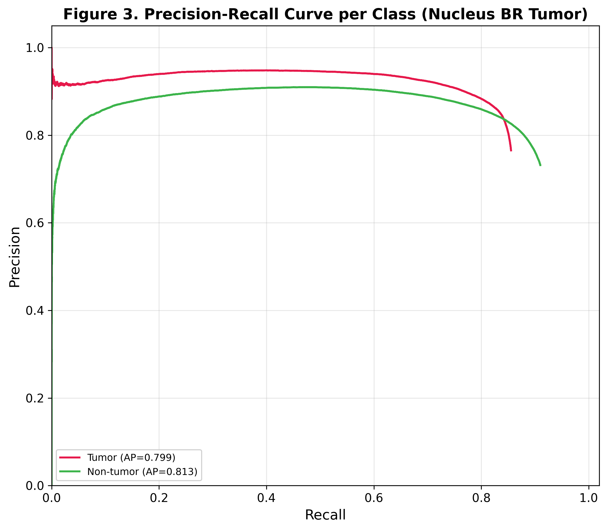
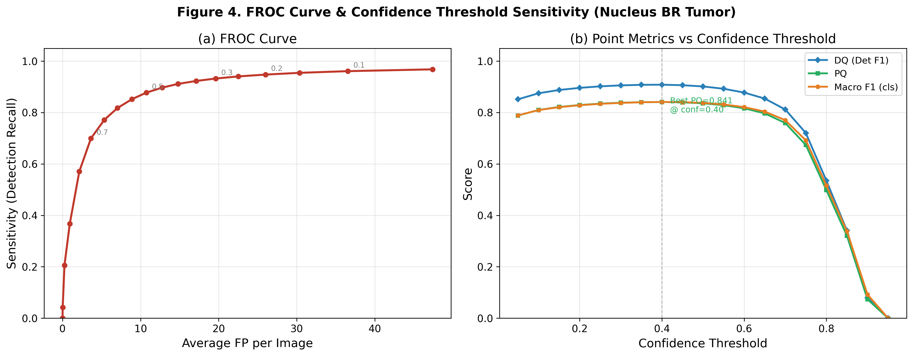
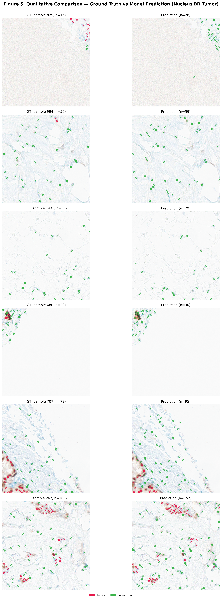
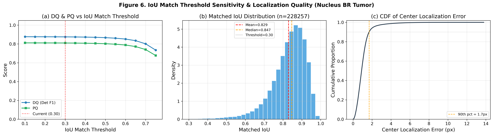
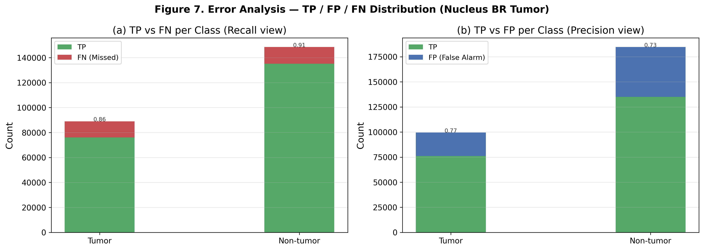
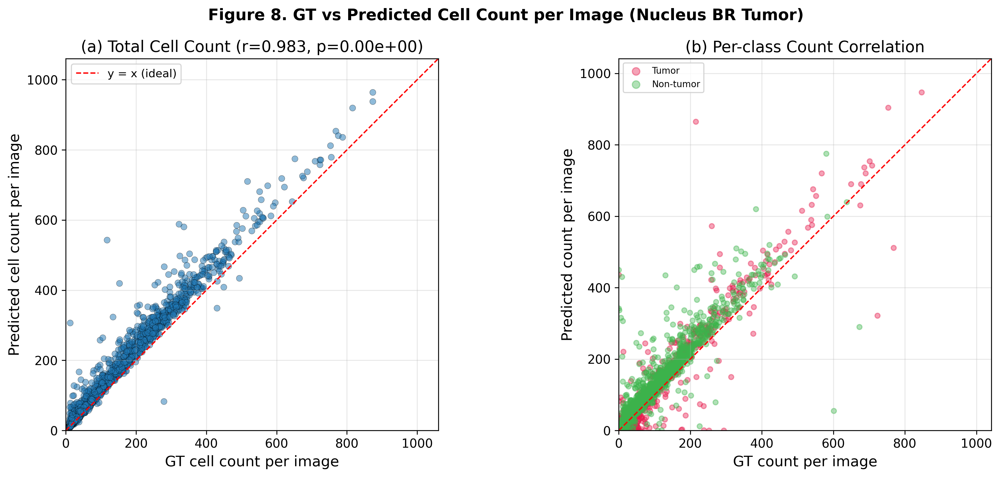

# Precise IHC Nucleus BR Tumor — Point-Detection Evaluation (YOLOv11)

## 🤖 AI Assistant Context

| Item | Source of truth |
| --- | --- |
| Model role | ER/PR nuclear IHC patch에서 세포를 탐지하고 Tumor / Non-tumor로 분류 |
| Data source | `../../data/precise_BC_cell_scoring/er_pr/` |
| Label field | `was_nonT` (`class_id`가 아님) |
| Class mapping | `0 = Tumor`, `1 = Non_Tumor` |
| Checkpoint | `../../model/precise_BC_cell_scoring/IHC_nucleus_BR_tumor/best_model.pt` |
| Train notebook | `Precise_IHC_nucleus_BR_tumor_train.ipynb` |
| Evaluation notebook | `Precise_IHC_nucleus_BR_tumor_test.ipynb` |

> **Important:** 이 모델은 tissue-level tumor mask segmentation 모델이 아니라 **세포 단위 binary detection/classification 모델**이다. Tumor region mask는 별도 pipeline으로 다룬다.

## Key Metrics

- **DQ (Detection Quality)**: class-agnostic 탐지 F1
- **CQ (Classification Quality)**: 매칭된 세포의 Tumor / Non-tumor 분류 정확도
- **PQ (Panoptic Quality)** = DQ × CQ
- **MLE (Mean Localization Error)**: 매칭 쌍의 평균 중심 거리 (px)
- **FROC**: Sensitivity vs Avg FP/image

## 📌 Experiment Setup

| Item | Value |
| --- | --- |
| Task | ER/PR nuclear IHC cell detection + Tumor/Non-tumor classification |
| Validation set | 1,531 patches / 237,519 GT cells |
| Val split | `train_test_split(test_size=0.1, random_state=242)` |
| Input size | 512×512 |
| Checkpoint | `best_model.pt` (epoch 279) |
| Confidence threshold | 0.10 |
| NMS | **Class-agnostic**, IoU = 0.30 |
| Matching | **IoU-based Hungarian**, IoU ≥ 0.30 |

---

## 🏆 Overall Performance (TL;DR)

| Metric | Value |
| --- | ---: |
| **DQ** (Detection F1) | **0.8750** |
| **CQ** (Classification Accuracy) | **0.9257** |
| **PQ** (= DQ × CQ) | **0.8100** |
| Macro F1 | 0.8095 |
| Micro F1 | 0.8100 |
| Weighted F1 | 0.8099 |
| Mean IoU (matched) | 0.8295 |
| Mean Center Error | 1.02 ± 0.76 px (median 0.90 px) |

- Detection Recall **96.1%**, Precision **80.3%**로 high-recall / high-FP 특성을 보임.
- 매칭된 세포의 Tumor/Non-tumor 분류 정확도는 **92.6%**로 양호하지만 Tumor→Non-tumor 혼동이 반대 방향보다 크게 나타남.
- 전체 counting 상관은 **r=0.983**으로 높지만 membrane model보다 산포와 outlier가 더 큼.

---

## 📊 Table 1 — Per-class Detection + Classification

| Class | GT | TP | FP | FN | Precision | Recall | F1 |
| --- | ---: | ---: | ---: | ---: | ---: | ---: | ---: |
| **Tumor** | 89,016 | 76,152 | 23,356 | 12,864 | 0.7653 | 0.8555 | **0.8079** |
| **Non-tumor** | 148,503 | 135,146 | 49,558 | 13,357 | 0.7317 | 0.9101 | **0.8112** |
| **Macro Avg** | 237,519 | 211,298 | 72,914 | 26,221 | **0.7485** | **0.8828** | **0.8095** |
| **Micro Avg** | — | — | — | — | 0.7435 | 0.8896 | **0.8100** |
| **Weighted Avg** | — | — | — | — | — | — | **0.8099** |

**관찰 포인트**

- Tumor/Non-tumor F1은 각각 0.8079, 0.8112로 매우 유사하지만 오류 유형은 다름.
- Tumor Recall이 0.8555로 Non-tumor 0.9101보다 낮아 Tumor cell miss가 상대적으로 더 큰 문제임.
- Non-tumor Precision이 0.7317로 낮은 것은 Non-tumor 예측 FP가 49,558건으로 많기 때문임.
- Macro/Micro/Weighted F1이 모두 약 0.81로 유사해, class count 불균형이 종합 F1을 크게 왜곡하지는 않음.

---

## 📋 Table 2 — Point Detection Summary

| Category | Metric | Value |
| --- | --- | ---: |
| **Detection (class-agnostic)** | Total GT boxes | 237,519 |
|  | Total Predictions | 284,212 |
|  | Matched (TP_det) | 228,257 |
|  | Detection Precision | **0.8031** |
|  | Detection Recall | **0.9610** |
|  | Detection F1 (= DQ) | **0.8750** |
| **Localization** | Mean IoU (matched) | 0.8295 |
|  | Mean Center Error | 1.02 ± 0.76 px |
|  | Median Center Error | 0.90 px |
| **Classification (matched)** | Accuracy (= CQ) | **0.9257** |
|  | Macro F1 | 0.8095 |
|  | Micro F1 | 0.8100 |
|  | Weighted F1 | 0.8099 |
| **Panoptic Quality** | DQ | 0.8750 |
|  | CQ | 0.9257 |
|  | **PQ = DQ × CQ** | **0.8100** |
| **FROC** | Avg FP / image | 36.55 |

---

## 🖼️ Figures

### Figure 1 — Confusion Matrix (Count / Row-normalized)

- Matched Tumor의 88%가 Tumor, 12%가 Non-tumor로 분류됨.
- Matched Non-tumor의 95%가 Non-tumor, 5%가 Tumor로 분류되어 **Tumor→Non-tumor 오류가 비대칭적으로 더 큼**.

### Figure 2 — Per-class Precision / Recall / F1

- 두 클래스 모두 Recall이 Precision보다 높아 over-prediction 경향을 보임.
- Tumor는 recall 개선, Non-tumor는 precision 개선이 각각 우선 과제임.

### Figure 3 — Precision-Recall Curve per Class (AP)

| Class | AP |
| --- | ---: |
| Tumor | **0.799** |
| Non-tumor | **0.813** |

- Non-tumor AP가 약간 높지만 두 클래스 모두 0.8 내외로 비슷한 수준임.

### Figure 4 — FROC Curve & Confidence Threshold Sweep

- 현재 `conf=0.10`은 Detection Recall 96.1%, Avg FP/image 36.55의 high-recall 운영점.
- sweep에서 **best PQ ≈ 0.841 @ conf=0.40**으로 나타남.
- conf 0.35–0.45 구간에서 PQ와 Macro F1이 안정적이며, 독립 test set에서 운영 threshold를 재검증할 필요가 있음.

### Figure 5 — Qualitative Comparison (GT vs Prediction)

- ER/PR nuclear patch의 GT(왼쪽)와 prediction(오른쪽)을 Tumor/Non-tumor 색상으로 overlay.
- 염색이 약한 tumor nucleus, lymphocyte/염증 세포, overlapping nucleus에서 오류가 집중되는지 정성 검수할 필요가 있음.

### Figure 6 — IoU Match Threshold Sensitivity & Localization Quality

- Matched IoU: mean 0.829, median 0.847.
- Center localization error 90th percentile: **1.7 px**.
- localization은 양호하며 주요 병목은 box 위치보다 FP와 binary classification임.

### Figure 7 — TP / FP / FN Error Analysis

- Tumor FN rate 14.5%, Non-tumor FN rate 9.0%로 Tumor miss 비율이 더 높음.
- Non-tumor FP 49,558건이 Tumor FP 23,356건보다 크게 나타남.

### Figure 8 — Per-image GT vs Predicted Count Scatter

- 전체 cell count 상관은 **r=0.983**으로 높음.
- 고밀도 patch에서 over-counting과 일부 큰 outlier가 보이므로, count MAE와 density 구간별 bias를 추가 산출할 필요가 있음.

---

## 🔍 Discussion & Next Steps

1. **Tumor miss 개선**
   - Tumor Recall 0.8555와 Tumor→Non-tumor 12% 혼동이 핵심 문제.
   - 염색이 약한 tumor nucleus, 소형 tumor cell, lymphocyte-rich 영역을 hard-example로 분류해 재학습/검수.

2. **FP 감소와 threshold calibration**
   - Avg FP/image 36.55이며 validation sweep은 `conf=0.40`에서 더 높은 PQ를 보임.
   - conf 0.35–0.45 구간을 독립 test set에서 재검증.

3. **Tissue segmentation과 역할 분리**
   - 이 모델은 세포 단위 Tumor/Non-tumor 예측이며 tumor region mask 자체를 생성하지 않음.
   - tissue-level mask 내 예측만 집계하는 downstream filter가 필요.

4. **Membrane model과의 직접 수치 비교 주의**
   - nucleus는 ER/PR, membrane은 HER2 데이터를 사용하므로 현재 성능 차이를 modality 우열로 해석하면 안 됨.
   - 동일 patient/region의 paired modality 데이터가 있을 때만 fusion/comparison을 수행.

5. **독립 patient/slide-level test**
   - 현재 수치는 model selection에 사용된 patch-level validation 결과임.
   - 동일 slide/patient patch가 train/validation에 동시에 들어가지 않도록 group holdout으로 최종 성능을 재산출해야 함.
