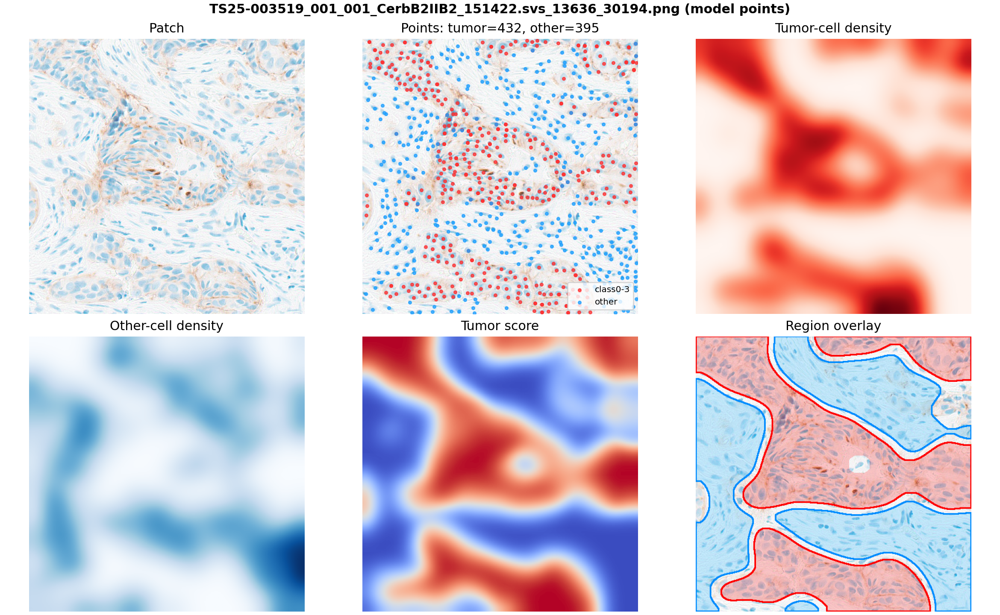
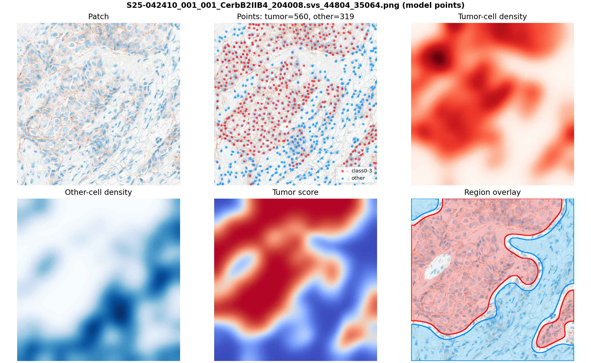
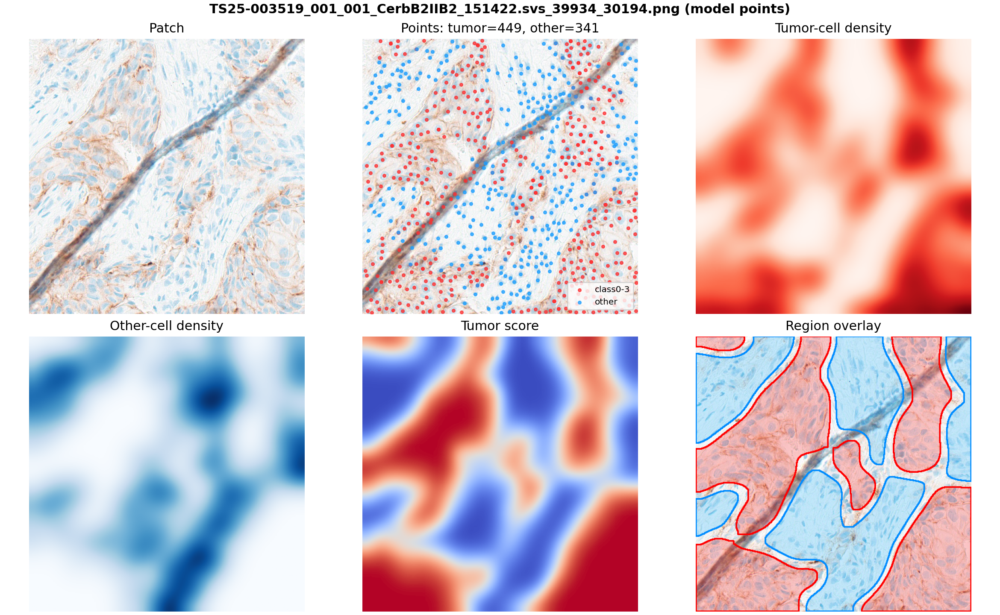
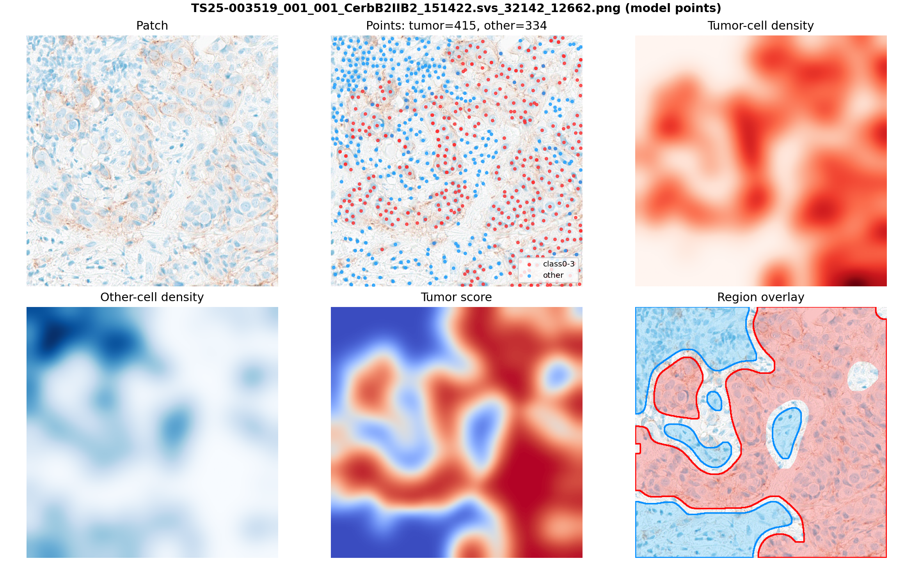
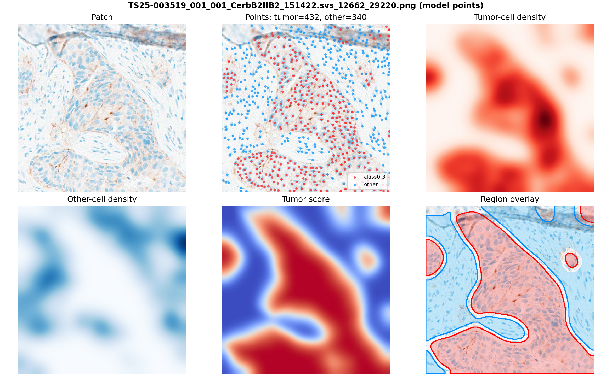

# Tumor / Non-tumor Region Examples

## Example 1

- Patch: `TS25-003519_001_001_CerbB2IIB2_151422.svs_13636_30194.png`
- Point source: `model`
- Detections/points: `827`

## Example 2

- Patch: `S25-042410_001_001_CerbB2IIB4_204008.svs_44804_35064.png`
- Point source: `model`
- Detections/points: `879`

## Example 3

- Patch: `TS25-003519_001_001_CerbB2IIB2_151422.svs_39934_30194.png`
- Point source: `model`
- Detections/points: `790`

## Example 4

- Patch: `TS25-003519_001_001_CerbB2IIB2_151422.svs_32142_12662.png`
- Point source: `model`
- Detections/points: `749`

## Example 5

- Patch: `TS25-003519_001_001_CerbB2IIB2_151422.svs_12662_29220.png`
- Point source: `model`
- Detections/points: `772`

